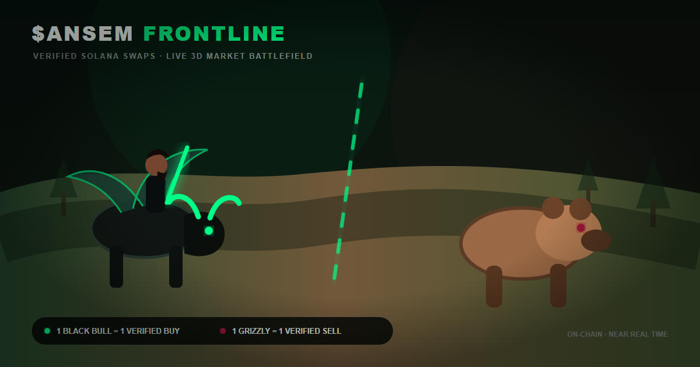

# $ANSEM FRONTLINE

An open-source 3D market visualization that turns verified `$ANSEM` swaps on Solana into a live bull-versus-bear battlefield.



- Token: `$ANSEM`
- Contract address: `9cRCn9rGT8V2imeM2BaKs13yhMEais3ruM3rPvTGpump`
- Live application: [ansem-frontline.vercel.app](https://ansem-frontline.vercel.app/)

## What the visualization means

| Market event | Battlefield representation |
| --- | --- |
| Verified buy | One individually inspectable black-bull champion |
| Verified sell | One individually inspectable grizzly champion |
| Buy worth at least 20 SOL | Giant black bull with luminous green eyes and aura |
| Sell worth at least 20 SOL | Giant bear with luminous red eyes and aura |
| Reported buy/sell counts across tracked pools over one hour | Strategic depth of each instanced army |
| Reported buy/sell counts across tracked pools over five minutes | Immediate activity pulse and reinforcements |
| Verified buy/sell SOL over 60 seconds | Army aggression and pressure-line movement |
| Compact Pixel Frontline | Only verified 30-second swaps; normal and giant pixel troops |
| Five or more unique buys totaling at least 5 SOL in 12 seconds, with ≥75% buy dominance | The flying Bull King casts three green support waves |
| A giant buy, buy-regime reversal or sustained ≥65% buy pressure reclaims territory containing stranded bears | The Bull King clears those isolated units with a green staff ray |
| 60-second net buy/sell volume | Bull/bear dominance and frontline position |
| Reference-pool OHLCV | One-hour mini price chart |
| Selected battlefield combatant | Verified SOL size, USD value, pool, age and direct Solscan transaction link |

The visualization deliberately separates inspectable swaps from market-scale ranks. Each detailed foreground champion originates from a Helius or GeckoTerminal swap and links to its Solscan transaction. The lower-detail army ranks are an explicit aggregate visualization: strategic depth starts from DexScreener's reported one-hour buy/sell counts, while the five-minute pulse, verified 60-second SOL and recent verified swaps control the immediate wave. The square-root hourly term and other sub-linear weights prevent one busy pool or whale from masquerading as hundreds of independent signatures. Aggregate ranks are not presented as one character per transaction. This allows a quiet market to remain a skirmish and a genuinely high-activity market to grow toward hundreds per side without manufacturing data. Combat motion, damage and the Bull King's actions are visual metaphors and never alter price, dominance or the underlying trade feed.

The display deliberately separates time horizons so activity and trend are not conflated: the mini chart shows one-hour price direction, strategic army depth encodes one-hour transaction counts, the sidebar exposes the five-minute activity pulse, and the frontline/pressure bars encode verified SOL flow over the latest 60 seconds. The optional Pixel Frontline is narrower by design and uses only verified swaps from a rolling 30-second window. The segmented pressure marker represents a rolling market balance, not a wall or collision boundary. A visible coverage label discloses both the recent verified-swap count and the volume-weighted visual force per side. Detailed champions are capped at eight recent swaps per side; instanced ranks scale to 260 per side on capable devices and 120 per side on constrained devices.

Units can cross the pressure line to patrol contested ground or pursue a verified opposing swap. Their operating area shifts continuously with 60-second SOL control rather than snapping to either side of the line. Target acquisition is distance-based across the arena and never turns off merely because a unit crossed the market marker. Aggregate ranks advance through 26 tactical corridors across a widened arena, opening sparse central skirmishes into woodland flanks as volume grows. Each corridor has one bull and bear vanguard pair; remaining ranks follow their living predecessor and take the contact position when it falls. Stable per-agent lateral/depth offsets prevent a rigid grid without turning the market force into random motion. Replacements enter behind the least-populated column instead of appearing inside the battle. Bounded turn speeds, anticipatory tree/rock avoidance, local collision cells and explicit champion-versus-rank contact keep the two forces physically distinct. A blocked verified champion attacks the local opposing rank instead of repeatedly moving and being clamped back, eliminating the former vibration failure. A pressure change removes losing contact ranks and supplies replacements from their camp; it never drags surviving ranks backwards or binds them to the marker. Regular verified units remain for 75 seconds and giant trades for 105 seconds, then retire without being counted as combat defeats; this keeps the battlefield representative of recent activity instead of accumulating historical trades forever.

The pressure line never participates in collision detection or target cancellation. Idle verified units alternate between waypoints placed on opposite sides of it, while combatants may pursue verified opponents anywhere inside the arena. If a grizzly reaches the Bull King's immediate airspace while the market is balanced or buy-controlled, the King turns, closes distance and casts a visible ward that repels the intruder toward bear territory. Under clear sell control he does not erase a valid invasion: he moves behind the surviving bull vanguard in `guard`, watches the active contact lane and yields territory with the market. The verified sell remains alive during bear control; only a qualifying buy reversal or sustained buy control can clear it through the separate reclamation rule.

The Bull King is a persistent visual commander inspired by the project's character artwork. A buy swarm can temporarily illuminate and strengthen existing bulls in the illustrative combat layer, but it never creates synthetic trades or directly changes dominance, price, or frontline position. Swarms have a 25-second cooldown and ignore duplicate transaction signatures.

Territorial reclamation is similarly deterministic: after a buy-regime reversal, a giant buy that advances the frontline materially, or sustained buy control of at least 65%, the King targets only verified bears left behind the new bull line. His staff ray retires those isolated units and records the trigger in the battle log; bears still positioned on their valid side remain untouched, and the effect has no influence on market calculations.

The King uses a deterministic command state instead of aimless patrol motion. He stays behind the actual bull formation in `overwatch`, tracks the busiest combat lane with a minimum command hold, advances to `lead` during buy control, repositions deeper and gains altitude in `guard` during sell control, moves into `rally` for buy swarms and enters `defend` only for a justified ward. Position, orientation, banking, wings and staff all transition with capped linear and angular speeds between those objectives.

The `PIXEL 30S` control opens a compact, non-interactive pixel-art companion. Chromium-family browsers with Document Picture-in-Picture can keep arbitrary HTML above other windows; Firefox receives a compact popup fallback because ordinary web content cannot demand OS-level always-on-top behavior. While the companion is open, the main page becomes black and pauses WebGL, but data ingestion continues. A future native wrapper (for example Tauri) could provide strict always-on-top and taskbar-adjacent placement across browsers; the current web version does not claim that unsupported OS capability.

When the page is hidden, the WebGL loop pauses instead of wasting battery on frames the browser cannot display. Returning to the page resets the render clock, refreshes market state, reconfigures the live stream, conservatively catches up recent pool trades and summarizes verified flow received while away. The renderer also adapts pixel density on sustained slow devices, pools short-lived projectiles and particles, respects reduced-motion preferences and recovers from WebGL context loss without altering market data.

## Data methodology

DexScreener's official token-pairs endpoint is used in the browser to discover active Solana pools, calculate a liquidity-weighted token price and obtain five-minute and one-hour directional transaction counts. If that discovery request is unavailable, the Cloudflare Worker derives a conservative fallback price from Helius DAS metadata and returns five explicitly identified high-activity SOL/USDC pools; the interface labels this reduced coverage as `FALLBACK` instead of implying full market coverage. The browser sends the selected public pool addresses and current market prices to a Cloudflare Durable Object, which validates them before opening the preferred Helius WebSocket path. The Worker parses confirmed balance changes and broadcasts normalized trades without exposing the Helius key. A rate-limited GeckoTerminal warm-up loads recent verified swaps even when Helius connects immediately; if Helius does not explicitly confirm `live`, the browser restores conservative GeckoTerminal polling. The Worker exposes only validated Solana pool trade and minute-OHLCV paths through a short-lived cache, avoiding browser CORS failures without becoming an open proxy. GeckoTerminal supplies the historical swaps and candles, whose failure remains isolated from the live trade feed.

Trade value is normalized to SOL:

- SOL pools use the exact wrapped-SOL amount from the swap.
- Stablecoin pools divide verified USD volume by the derived SOL/USD price.
- Each trade links to its Solscan transaction for independent verification.

The UI displays the number of monitored pools and their share of DexScreener-reported 24-hour volume. This is a near-real-time visualization, not an exchange feed: public API polling introduces several seconds of latency and extremely short-lived trades may be delayed. It is not financial advice.

## Architecture

```text
DexScreener ── primary pool discovery, price, liquidity, market cap
      │
      ├── pool ranking and coverage calculation
      │
Helius DAS ── fallback price and known SOL pools
      │
Helius WSS ── confirmed pool transactions
      │
Cloudflare Durable Object ── secure parsing and WebSocket broadcast
      │
      ├── automatic fallback: GeckoTerminal verified swaps
      ├── GeckoTerminal OHLCV
      │
      ├── parsing, SOL normalization, deduplication
      ├── rolling 60-second pressure model
      ├── one-hour army depth and five-minute activity pulse
      │
      └── Three.js battlefield
            ├── inspectable verified-swap champions
            ├── instanced volume-weighted market-force ranks
            ├── traversable rolling pressure line
            ├── trade-sized combat attributes
            ├── terrain, grass, rocks and trees
            └── bounded patrols, obstacle steering and stuck recovery

Browser companion ── verified rolling 30-second swaps
      └── pixel-art normal/giant bull and bear troops
```

The code deliberately separates external data (`api.js`), pure market calculations (`market.js`), volume/strategy rules (`battlefield.js`), navigation rules (`navigation.js`), UI (`ui.js`) and rendering/simulation (`scene.js`).

The production build places Three.js in its own content-hashed chunk so repeat visitors can retain the engine while simulation code changes. Vercel serves hashed assets with a one-year immutable cache policy. Dynamic army transforms use seven `InstancedMesh` buffers per side—body, accent, eyes and four independently animated legs—so hundreds of ranks remain practical without sacrificing readable gait or eye colour.

## Local development

Requirements: Node.js 20.19 or newer.

```bash
npm ci
npm run dev
```

Production checks:

```bash
npm run lint
npm test
npm run build
npm run test:e2e
```

For a five-minute real-data movement and stability soak, run `npm run dev -- --port 4174` in one terminal and `npm run test:soak` in another. Set `SOAK_SCENARIO=stress` to cycle through quiet, buyer surge, balanced high volume, seller surge and buy reversal. The monitor checks line crossings, stalled patrols, army/champion overlaps, missing eye or leg instances, woodland engagements, King camera containment, arena bounds, viewport coverage, render load and browser/network errors.

## Project structure

```text
index.html                 Application shell
pixel-frontline.html       Compact pixel companion shell
css/styles.css             Responsive interface
css/pixel.css              Pixel companion surface
js/config.js               Public token and polling configuration
js/market.js               Pure pool/trade/pressure calculations
js/battlefield.js          Pure force-scaling and tactical doctrine
js/navigation.js           Arena bounds, lanes, patrols and lifetime rules
js/api.js                  Resilient multi-pool data ingestion
js/state.js                Runtime state
js/ui.js                   Safe DOM rendering and controls
js/scene.js                Three.js world and combat simulation
js/companion.js            Picture-in-Picture/popup lifecycle and live sync
js/pixel-engine.js         Pure 30-second pixel battlefield renderer
js/stream.js               WebSocket client and reconnection
worker/src/index.js        Cloudflare/Helius real-time relay
worker/src/configuration.js Validated public pool configuration
worker/src/market-fallback.js Helius market fallback normalization
worker/src/parser.js       Generic Solana balance-change parser
tests/market.test.js       Market semantics and parsing tests
tests/battlefield.test.js  Force scale, doctrines and King modes
tests/navigation.test.js   Deterministic movement and lifecycle tests
.github/workflows/ci.yml   Automated quality gate
.github/workflows/codeql.yml Security-extended JavaScript scanning
.github/dependabot.yml     Weekly npm and Actions updates
SECURITY.md                Private vulnerability reporting policy
CONTRIBUTING.md            Development and code standards
CHANGELOG.md               Versioned release notes
vercel.json                Deployment and security headers
```

## Privacy and security

The application has no accounts, cookies, wallet connection or trading capability. Its optional Cloudflare relay only transforms public on-chain transactions into a browser stream and does not persist user data. The repository contains no private API keys. Wallet addresses visible in the public trade feed originate from public Solana transactions and are not persisted by this project.

The optional Helius credential is stored only as a Cloudflare Worker secret. `VITE_STREAM_URL` is a public relay URL and can safely be configured in Vercel.

GitHub Dependabot monitors npm and workflow dependencies weekly, while CodeQL runs the `security-extended` JavaScript query suite on pushes, pull requests and a weekly schedule. Vulnerabilities should be reported privately as described in [SECURITY.md](SECURITY.md).

## Free real-time relay deployment

1. Create free Helius and Cloudflare accounts.
2. Authenticate Wrangler with `npx wrangler login`.
3. Store the key securely: `npx wrangler secret put HELIUS_API_KEY --config worker/wrangler.jsonc`.
4. Deploy: `npm run worker:deploy`.
5. Configure the resulting `/stream` WebSocket URL as `VITE_STREAM_URL` or update the public fallback in `js/config.js`, then redeploy the frontend.

Never add the Helius key to `.env`, Vercel client variables or source control.

## Limitations and roadmap

- Without the relay, or while its streaming path is unavailable, public polling is near-real-time and the five-pool cap plus 8-second global cadence protects GeckoTerminal's public rate limit. A `429` pauses all fallback trade polling for 60 seconds instead of creating a retry storm.
- DexScreener outages reduce discovery to five known SOL/USDC pools and Helius metadata; the application marks that state as fallback coverage and does not invent an hourly change value.
- With the relay, the five highest-scoring pools discovered by DexScreener are subscribed over Helius standard WebSockets; unsupported or unusual transactions can still fall back to the polling source.
- Free-service quotas are suitable for a portfolio demo, not an SLA-backed trading product.
- Combat outcomes are illustrative and do not predict price movement.

## License

[MIT](LICENSE) © 2026 PowerPixelKK.
