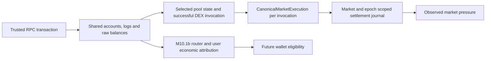

# Market data integrity — M10.1

**Current status: M10.1 MARKET DATA INTEGRITY COMPLETE WITH NON-BLOCKING PROTOCOL LIMITATIONS — M10.2 TERRAIN READY.** The M10.1e cleanup at the end supersedes earlier readiness statements. Standard Pump curves and PumpSwap have positive execution and canonical-valuation proof with independent Pyth USD freshness. Unsupported protocol variants and unsupported quote/extension semantics fail closed. M10.2 may consume only eligible observations and verified canonical executions; missing evidence is never inactivity.

## A. Baseline
Started at `bf8ff6a6dc1a4bf664df96862e361bb3d0e62777`, equal to local main and origin/main. The original terrain branch was empty, clean, and had no upstream. Renamed locally to `feat/m10-market-data-integrity` before implementation. No terrain implementation existed. The earlier M10 audit stopped on data integrity.

## B–C. Reproduced failures and causes
Nine regression cases were run and failed before the fixes in `tests/integrity-regression.test.js`.

| Defect | Cause | Required boundary now |
| --- | --- | --- |
| Reordering pairs changes 1M to 20M at the same relevant price | Display valuation came from an array-first provider entry, separate from pool/price choice | A deterministic primary pair supplies both price and typed valuation |
| FDV shown as MC | Provider fields and total-supply multiplication shared legacy mcap | MARKET_CAP, FDV, UNKNOWN; mcap is populated only for provider MARKET_CAP |
| Same transaction changes USD with browser price | Balance-derived amount multiplied by client price in the server parser | No client market arguments enter verification; quote transfers precede any USD estimate |
| Transfer/airdrop/LP-like delta becomes buy/sell | Sign of balance movement treated as swap proof | Successful supported swap invocation plus scoped SPL transfers and explained tracked-token net |

The original unproved delta fixture is rejected at all three client prices (.001, .020, 999). A separate positive, raw-protocol swap fixture proves that an actual accepted event also remains identical at those prices.

## D. Architecture
Browser discovery uses public DEX Screener data for indicative market display. Gecko supplies an indicative chart only. Helius DAS is a fallback for metadata and price, with total-supply FDV explicitly distinguished from MC.

The browser sends only the requested Solana mint to the Worker. Both `/recent` and `/stream` resolve the same mint-scoped Durable Object. The server independently discovers candidate pools, checks their account owners through RPC, and subscribes to logs. Logs and signature history supply candidates, never trade proof. The same raw transaction verifier and settlement journal process both paths. This replaces the independent legacy history parser and client-trusting stream configuration.

## E–F. Selection, hysteresis and epochs
Input pairs are treated as an unordered set. Eligibility requires Solana, tracked base mint, valid pair address, supported exact quote mint, positive finite price and liquidity. Supported quotes are wrapped SOL, USDC and USDT by mint, never by symbol. Reverse pairs where the tracked token is only the quote are unsupported.

Rank by liquidity, then hourly volume, then address. Conflicting duplicate pair identities are rejected. More than 500 input pairs is rejected; at most five pools are tracked. Retain a valid incumbent unless a challenger has at least 25% greater liquidity; invalidate a missing/ineligible incumbent immediately. Twenty-four permutations of four pairs and threshold oscillation tests establish order independence and stability.

Selection preserves token/pair/dex/base/quote, liquidity, reason, selection time, source and epoch. Server owner verification is a separate compatibility check; provider liquidity is not an on-chain fact.

Valuation has its own token-local epoch. Pool/provider/kind/supply-basis changes rebase it. A greater-than-1% change in implied value/price supply basis also rebases; this is a documented conservative discontinuity heuristic, not a claim to know circulating supply. Coherent 20x changes in price and value do not rebase merely for being large. No rebase creates a trade or a market shock.

## G–H. Typed valuation and MC/FDV proof
`CanonicalValuation` carries token, market identity, kind, value USD, price, supply basis, source, raw provider fields, observation/receipt times, epoch, freshness and provenance.

Valid provider marketCap wins as MARKET_CAP; otherwise valid fdv becomes FDV; neither becomes UNKNOWN with a null value. Total supply times indicative price produces FDV only. Unsafe numeric raw supply is not silently accepted as exact supply. The compatibility mcap field stays null for FDV and UNKNOWN. The main and Pixel displays label the actual kind and show an em dash for unavailable values.

All current provider valuations remain PROVIDER_INDICATIVE and authorityEligible=false. A provider-reported MC is not an independently audited circulating MC. DEX Screener exposes no current snapshot timestamp, so observedAt remains null; pairCreatedAt is never reused as observation time. Receipt older than 30 seconds becomes stale. Timestamp regression, invalid numeric values, mismatching token and selection identity are rejected. Cache is display-only and stale; it never hydrates trade authority.

## I. Client trust boundary
Mint is a request identifier. Prices, buy/sell labels, USD size, pools, program allowlists, arbitrary endpoints and settlement supplied by a client are discarded. Configuration is bounded to 8,000 characters and validated against the Durable Object mint. Server transport uses fixed RPC/provider hosts and an environment secret. Browser prices cannot corroborate themselves.

The deployment contract is version 3. Older Worker messages and older history/cache formats are rejected. Frontend and Worker require a coordinated future deployment; this milestone performs none.

## J–L. Evidence and protocol verification
Evidence preserves signature, slot, nullable chain block time, settlement, signers, relevant programs/instruction indexes, actual raw token and quote quantities/decimals, token net delta, ancillary native deltas and verification provenance/version. Worker observedAt/receivedAt and journal receipt time are separate from chain time. Native balance changes can include fees/rent and never substitute for swap quote quantities.

Adapters use documented fixed IDs and swap discriminators:
- PumpSwap: buy, sell and buy_exact_quote_in; pool, mint and vault account layout.
- Meteora DLMM: swap/swap2 and supported exact-out/price-impact variants.
- Orca Whirlpool: swap and swap_v2.

A successful runtime invocation and successful ancestor chain are required. Direct child SPL token transfers must touch the documented vaults, match mint/decimals, succeed, and have opposing base/quote economic directions. Failed or caught failed CPI, unknown programs, missing/truncated evidence, plain transfers, airdrops, mint/burn and LP-like deltas produce no authoritative event.

Raw integers are parsed with BigInt and bounded to u64; display quantities are approximate Number conversions. Token-2022 checked transfers are supported only when observed exact net flows agree and no transfer hook is involved. Transfer fees, hooks or unexplained deltas are rejected. This matters because the captured ANSEM transactions use Token-2022.

The verifier trusts the configured RPC response, rather than independently executing a Solana light client. RPC compromise is outside this trust boundary.

## M–N. Routes and direction
Direct and nested CPI swaps are supported when the tracked-token recipient/spender can be assigned to one transaction signer and all relevant legs have one direction, quote mint and owner. Multiple compatible legs aggregate to one tracked-token net event. Intermediate-token round trips and unrelated token transfers cannot become multiple fictional trades.

Shared router accounts owned by PDAs, unresolved final recipients, mixed directions/quotes and net mismatches are unsupported. In particular, recognizing a Jupiter CPI does not prove end-user economic attribution. The public Whirlpool examples hit this limitation. BUY means the signer receives the tracked token through the proven swap; SELL means spending it. These constraints establish a safe subset, not full Jupiter coverage.

## O. Quote and USD provenance
The authoritative quote quantity is the pool-side gross quote flow. It may include protocol fees and is not a claim about the user's total route expense. SOL quantities remain lamports plus decimals; stablecoin quantities retain their actual mint and units. Stablecoin trades never acquire a fabricated SOL equivalent.

Canonical events currently leave USD unknown. `js/notional.js` provides a separate optional estimate contract: stablecoin parity is explicitly an assumption; an independent SOL/USD spot quote must identify its source and recent receipt. This helper is not wired to acquire a live quote. The UI displays USD — rather than multiplying tracked-token amount by a browser price. Any future estimate is marked approximate and does not affect swap verification or pressure.

The prepared corroboration classifier can distinguish source rebase, unavailable, uncorroborated, disagreement and independently corroborated execution price. It does not certify supply or make MC authoritative, and is not a live corroboration service.

## P–Q. Settlement and reconciliation
Confirmed RPC data can produce a provisional event immediately. Every three seconds, bounded batches inspect signature statuses. Finalized status triggers another transaction read at finalized commitment and the same verifier. Same identity upgrades to FINALIZED; it is never a second trade.

Failed/inconsistent finalized evidence invalidates the prior event. Missing/repeatedly unavailable evidence or an unresolved 90-second reconciliation deadline becomes RECONCILIATION_UNKNOWN. Derived pressure is rebuilt from active journal events. The presentation can remove the corresponding entity/feed row; it never generates an opposite trade. Historic cosmetic animations already shown cannot be undone in time. A finalized record cannot be downgraded by a late confirmed replay.

## R–S. Identity, replay and bootstrap
Identity is tracked mint + signature + net-v1 discriminator. Dedup applies before expensive verification and again at the client journal. Slot orders observations; browser arrival time does not reorder chain events.

The record/journal limit is 1,024 entries per token, with a five-minute maximum age and 128 queued initial candidates. Replays do not refresh the record age. Bootstrap uses bounded getSignaturesForAddress queries with per-pool cursors and the same verification service as live logs. A full 12-item page marks an unproven history gap. Recent responses explicitly use no-store, including after CORS headers are applied.

The Durable Object journal is in memory. Restart may lose replay/reconciliation context; bounded history can recover some events, but durable exactly-once delivery and gap-free replay are not promised.

## T–U. Pressure and degraded states
Pressure includes unique active CONFIRMED/FINALIZED trades with real timestamps within 60 seconds. Failed, unknown, unverified, future and duplicate events contribute nothing. Existing pressure units remain actual SOL pool flow. Verified USDC/USDT swaps are visible but excluded from SOL-weighted pressure; diagnostics count that exclusion. No synthetic USD/SOL conversion fills it.

Provider activity counts and Gecko chart remain indicative displays. They are not canonical executed trades.

Missing adapters/evidence, RPC failure, queue/budget overflow and history truncation set degraded diagnostics. Coverage degradation is conservative and remains sticky for the active service; recovery does not prove an old gap was filled. Observational freshness can recover with a valid new market response.

## V. Token isolation
Selections, valuations, epochs, journals, subscriptions and reconciliation are scoped to mint. Destroying a browser runtime aborts pending fetches, stops its stream and clears its timers; late results are ignored. Tests cover ANSEM, USDC, JUP and an additional valid mint in the test-only soak. Identity checks prevent foreign-token history from entering the active journal.

## W. Performance and cost
No new dependency, database, paid provider or subscription was introduced. Current per-active-mint limits:
- At most five pool subscriptions, 64 browser sockets, two concurrent transaction reads.
- At most 120 getTransaction reads per minute, including finalization and retries.
- At most one status request every three seconds, carrying up to 50 signatures.
- At most five signature history requests per 15 seconds, 12 signatures per pool.
- Successful market discovery/owner checks cached for 60 seconds; RPC requests time out after eight seconds.
- Initial null/error reads retry at most three times with backoff. Reconnect delay grows from one to 30 seconds. Client watchdog is 30 seconds; idle services stop after 120 seconds without clients.

Thus saturated transaction verification alone is capped at 172,800 reads/day/mint; statuses and signature discovery add up to 28,800 each/day/mint while continuously active. Two successful transaction reads per finalized trade imply a ceiling around 60 newly finalized trades/minute before retries. Actual observed demand and paid-credit pricing were not measured; these are request ceilings, not a free-tier cost guarantee. Browser DAS fallback calls and discovery are additional.

Per-mint bounds are not a global account quota. Many distinct requested mints multiply cost. This is a deployment/operations limitation; no global admission service was added. When load exceeds the budget the system exposes partial coverage instead of inventing a complete feed.

## X. Public-chain validation
Read-only public mainnet RPC capture on 2026-09-12 obtained 23 successful candidate transactions from the current PumpSwap, Meteora DLMM and Whirlpool pools at finalized commitment. Pool account owners were independently requested. [The sample register](market-data-samples.json) records every signature, slot, protocol, mint, settlement, outcome/rejection reason, accepted direction/raw amounts and capture provenance.

Four PumpSwap sales were accepted. Two direct and two CPI sales agree with an independent signer token-balance calculation. Representative exact checks:
- Slot 446437184, signature 4YquguNEKkyksSma6sB7boFkj1gP4cLVXF1CUEgqi1K7Yx5sqdPk9Wr4naeHYaRyi1BbKBxwAcf1PfJfw3D1gGkN: tracked raw -126000000; gross quote 182115486 lamports.
- Slot 446442038, signature 4hRRByUJeR5cyfHc9L5C2PJywyCxv1UJaWHMcA3221wDG1cVa8x647xi1VDUdy7BR43VPqsTiPFnVTG2XXqdLXzu: tracked raw -300000000; gross quote 433333074 lamports, nested CPI.

The checked quote totals come from scoped SPL transfers and independently match the wrapped-SOL vault balance changes (-182115486 and -433333074 raw units) at vault DaXhQ3pfN3J5dQnXxVU8YqW9bwA3RUVxXvq2iBjTDVt4, with nine decimals. They are inspectable in the committed raw public fixtures. Four representative fixtures (positive direct/CPI and negative DLMM/Whirlpool) are preserved for offline replay. Tests assert literal expected quantities and independent balance arithmetic rather than taking expected values from the verifier.

Nineteen candidates were rejected. This is not a measured false-negative rate or volume coverage percentage: mentions include non-swaps and arbitrage. No accepted real buy, DLMM or Whirlpool end-user event was demonstrated in this bounded sample. Deterministic protocol fixtures passing is not a substitute for that missing external coverage.

## Y. Security
Fixed upstream endpoints; validated mint/signature; fixed protocol tables; independently discovered pools; secret stays in Worker environment. No client-provided valuation, signature status or swap conclusion is promoted. Origin checks remain. Candidate limits, timeouts and per-mint budgets bound work. Caches cannot resurrect trusted historic events. A malformed or unsupported observation fails closed.

## Z–AC. Validation
Regression tests were introduced red before the fixes. The final verification record is maintained below. Tests use raw protocol-shaped fixtures separately from UI fixtures representing mocked version-3 Worker responses. Test-only data never enters production.

The first broad browser run overlapped development edits and six WebGL workers, so its failures were not accepted as a final baseline. A subsequent sandbox launch failed with EPERM before browser execution. The final suite is run with frozen browser code, one worker and the required local browser permission; assertions are not weakened to pass.

A 60-second, test-only ingestion soak completed 951 cycles across four tokens (1.0567 virtual hours), 76,080 duplicate/replay deliveries, 11,412 mocked RPC reads and 7,608 event/update publications. Maximum retained records was 76 per token; all queues finalized and teardown emptied every journal. This demonstrates bounded local mechanics, not provider uptime or a production Helius soak. WebSocket reconnect and cancellation are covered separately by lifecycle tests.

M4–M9 scene, theme, studio, Champion, navigation and Pixel/PiP tests remain in the complete E2E suite. No new combat/terrain/theme art was introduced.

Final checks:
| Check | Result |
| --- | --- |
| Lint | Passed |
| Unit suite | 30 files, 230 tests passed |
| Production browser build | Passed |
| Complete E2E run | 61 passed, 34 existing device skips, one obsolete whole-diagnostic equality assertion failed |
| Corrected E2E assertion | Focused last-failed run: 1 passed; comparison still checks runtime and renderer resources |
| Final affected-view smoke | Hidden/resume and MC/FDV/settlement checks passed after reconciliation adjustments |
| Soak and reconnect | 60-second soak above; 100 reconnects and silent-socket timeout tests passed |

Thus all 62 applicable E2E cases have passing evidence across the complete run and focused rerun; this is not a claim that the original complete command exited successfully. The unit suite also fixes a fixture-clock race by supplying the same explicit timestamp to a non-SOL pressure fixture.

## AD. Documentation and official contracts
Primary sources consulted for implementation:
- [DEX Screener API](https://docs.dexscreener.com/api/reference) — separate nullable marketCap/fdv and provider pair fields.
- [DEX Screener token listing](https://docs.dexscreener.com/token-listing) — FDV and circulating/self-reported supply semantics.
- [Helius getAsset](https://www.helius.dev/docs/api-reference/das/getasset) — cached price metadata; documented price cache is 600 seconds, so receipt is not source observation time.
- [Solana commitment](https://solana.com/docs/rpc) and [signature statuses](https://solana.com/docs/rpc/http/getsignaturestatuses) — confirmed and finalized are distinct.
- [Solana logsSubscribe](https://solana.com/docs/rpc/websocket/logssubscribe) — address mentions are candidates.
- [Solana token supply](https://solana.com/docs/rpc/http/gettokensupply) and [Token-2022 transfer fees](https://solana.com/docs/tokens/extensions/transfer-fees).
- [PumpSwap official IDL](https://github.com/pump-fun/pump-public-docs/blob/main/idl/pump_amm.json).
- [Meteora DLMM official IDL](https://github.com/MeteoraAg/dlmm-sdk/blob/main/idls/dlmm.json).
- [Orca swap](https://github.com/orca-so/whirlpools/blob/main/programs/whirlpool/src/instructions/swap.rs) and [swap v2](https://github.com/orca-so/whirlpools/blob/main/programs/whirlpool/src/instructions/v2/swap.rs).
- [GeckoTerminal FAQ](https://apiguide.geckoterminal.com/faq) — public rate limits and incomplete MC metadata.

## AE–AG. Files, diff and commit
Browser boundaries live in market-selection, market-valuation, market-evidence, market-api and notional modules. Worker boundaries live in server-market, protocol-verifiers, transaction-evidence, evidence-ingestion and stream-hub. Existing API/parser entry points retain compatibility facades with the new semantics. Existing UI, main and Pixel code changes are limited to truthful data display and reconciliation. Unit/E2E fixtures, public samples and capture/soak scripts support reproducibility.

Use `git diff bf8ff6a6dc1a4bf664df96862e361bb3d0e62777 --stat` for the complete committed file inventory and `git rev-parse HEAD` for the local completion commit. The response accompanying this document records its SHA. No push, PR, merge, deploy, tag or release.

## AH–AI. Remaining limits and exact readiness
Coverage of shared-account router economics is blocking. Before M10.2, implement and externally demonstrate attribution for the routes required by the actual market, with positive public buys and sells for each claimed supported family and measured coverage against the current candidate stream. Preserve all negative tests.

Further limits: current valuation is indicative, circulating supply is not independently certified, independent USD quote/corroboration acquisition is not live, non-SOL trades do not weight SOL pressure, provider timestamps can be unknown, in-memory restart can lose gaps, and per-mint budgets are not global billing guarantees. These facts must remain explicit when choosing future terrain authority. No value-to-world mapping is implemented.

M10.1 BLOCKED — VERIFICATION COVERAGE

## M10.1b — Router economic attribution and measured coverage (2026-09-13)

This section supersedes the earlier routing support/readiness statements, while preserving the M10.1 audit as history. The bounded implementation passes its deterministic gates. **The market-data milestone is still blocked by material verification coverage; this is not permission to build or release M10.2.** No live positive shared-route acceptance was demonstrated in the public sample.

### A–B. Baseline and reproduced blocker

Work remains on `feat/m10-market-data-integrity`, starting from the intact `3a16c4aff2741e63139474ee29951137a19d7fb7`. Both main refs remain `bf8ff6a6dc1a4bf664df96862e361bb3d0e62777`. The complete prior audit was read before editing. Running the original verifier from that commit against the new independently encoded shared direct, multihop, split and intermediate fixtures reproduces `ECONOMIC_OWNER_NOT_SIGNER` in all four cases. The new endpoint boundary resolves these deterministic cases without assigning a shared PDA to a user.

The original fixtures' one-byte mock Jupiter instruction was not a documented routing format. It has been replaced with independently encoded actual V2 instructions. The old accepted non-Jupiter CPI sale `4hRRByUJeR5c…` now fails `UNSUPPORTED_ROUTER`: signer balance agreement alone cannot prove an unknown wrapper's intent. The original direct sale remains accepted with the same independently checked raw quantities. No negative assertion was relaxed into acceptance.

### C. Current official research and the pinned on-chain IDL

Swap V2 `/build` replaces the legacy two-call integration, uses `taker`, defaults to V2 instructions and supports ExactIn. Its routing weights are basis points. API version does not erase historical on-chain instructions. No legacy API client was added. [Jupiter migration contract](https://developers.jup.ag/docs/swap/migration/metis-to-build).

The Meta-Aggregator can choose execution paths beyond the Jupiter Aggregator AMM program. A passive public observer cannot assume every winning router has Jupiter's account semantics or access someone else's `/execute` result/request ID. This implementation consumes public RPC only. [Jupiter order and execute](https://developers.jup.ag/docs/swap/order-and-execute). Separate payer and taker are supported explicitly by the integration contract and remain separate in attribution. [Jupiter gasless documentation](https://developers.jup.ag/docs/swap/advanced/gasless).

The inspected official `jupiter-cpi`, `instruction-parser`, `jupiter-amm-implementation` and CPI example repository IDLs lacked V2 instruction definitions. They were not silently treated as current. Jupiter's own announcement points to the program IDL and states that V1 on-chain instructions remain valid. [Jupiter program update](https://t.me/s/jup_dev?before=157), [program IDL view](https://solscan.io/account/JUP6LkbZbjS1jKKwapdHNy74zcZ3tLUZoi5QNyVTaV4#programIdl). The explorer's dynamic IDL data could not be retrieved here; its API returned HTTP 403. No explorer decoding is claimed.

Instead, finalized public mainnet RPC returned the IDL account `C88XWfp26heEmDkmfSzeXP7Fd7GQJ2j9dDTUsyiZbUTa`, owned by `JUP6LkbZbjS1jKKwapdHNy74zcZ3tLUZoi5QNyVTaV4`, at slot **446570768**. The retained compressed account bytes, owner, slot and SHA-256 are in [jupiter-idl-provenance.json](jupiter-idl-provenance.json). The uncompressed JSON hash is `3f0edbf2d65ec7be16b655348bcf63af70f3e64d19c68d9535048808167cc460`. A second read at slot 446598952 matched. The account uses the existing Anchor IDL seed/account layout; current documentation API branding is unrelated to this binary account format. [Anchor v0.31.1 IDL address and layout](https://github.com/coral-xyz/anchor/blob/v0.31.1/ts/packages/anchor/src/idl.ts).

`worker/src/idl/jupiter-v6.js` retains the eight non-ledger route definitions (V1/V2 × ordinary/shared × ExactIn/ExactOut) and type definitions from that snapshot. A bounded Borsh interpreter follows named fields and enum definitions. Tests compare every instruction definition with the retained RPC payload and independently derive its Anchor discriminator. Unknown enums/types/versions, oversized vectors, malformed/trailing bytes and unsupported ledger instructions fail closed. The snapshot is static; `scripts/check-jupiter-idl.mjs` is a manual read-only drift check, never an automatic trust upgrade.

### D–G. Economic endpoints, authority, account classes and token role

The router boundary adds authority, input/output mint, exact raw executed quantities and decimals, named source/destination, actual destination owner, ExactIn/ExactOut context, quoted context, instruction/version, route plan, account classes and proof provenance. Quote context is explicitly not execution.

The economic authority comes from the router's named `user_transfer_authority`, must be a transaction signer, and must own the source account. Delegated/non-signer authorities are unsupported. It is never chosen as the payer, first signer, largest delta or owner of a shared account. Direct DEX events also require their documented authority account to match the tracked-token owner, with a compatible user quote flow.

Source/destination accounts are USER_ENDPOINT. Accounts with documented router authority and conserved routing flow are SHARED_ROUTER_ACCOUNT; signer-owned intermediates are USER_ROUTING_ACCOUNT. Documented DEX vaults are POOL_ACCOUNT. Successfully initialized/closed ephemeral wSOL accounts are TEMPORARY_ACCOUNT, with lifecycle instructions preserved. Unknown owners remain UNKNOWN and reject the route. Fee-bearing routes currently fail closed rather than guessing FEE_ACCOUNT roles or net amounts.

The tracked token's proven endpoint role is INPUT → SELL or OUTPUT → BUY. A fully verified route using it only between endpoints returns NON_DIRECTIONAL / INTERMEDIATE with route evidence and no canonical event. NOT_INVOLVED is also non-directional. Unknown or partially decoded routes do not acquire a verified intermediate classification merely from a hint. User economic direction and pool price effects are distinct: these exclusions do not suppress the separate indicative valuation pipeline, and no synthetic market effect is created.

### H–K. Direct, multihop, split and intermediate proof

The existing PumpSwap, DLMM and Whirlpool adapters extract documented swap invocations and their direct-child transfers. For Jupiter they can extract all route legs, including those not touching the tracked mint. There is no second set of DEX parsers. Route-plan protocol/order/index/mint/weight checks, full leg count, successful invocation ancestry and connected source-to-destination transfer paths must agree. Non-vault intermediate flow must conserve exactly; residuals and disconnected flows reject.

The deterministic shared direct route spends raw 1,000,000,000 input units and delivers raw 200,000,000 output units. A two-hop route preserves those endpoint amounts rather than using the intermediate quote. A 40/60 split aggregates both legs into the same one event. Identity remains `mint:signature:net-v1`; multiple router invocations/authorities in a transaction are rejected, so the key cannot combine different takers. Transfer ordering that preserves semantics leaves canonical economic evidence unchanged.

The mandatory SOL → tracked → USDC shared fixture produces INTERMEDIATE, no BUY/SELL, no pressure and no future impact eligibility. The public `doqiTDJ9hQ24…` instruction also names SOL as input and another mint as output, with ANSEM in between; its fee-bearing/incompletely supported execution remains unsupported, not a verified intermediate event.

### L–M. SOL/wSOL, custom destination and execution modes

Swap size comes from successful scoped SPL transfers. Signer lamport deltas remain ancillary because they include fees, priority fees, tips and rent. Missing ephemeral wSOL balance identities are recovered only from successful SPL initialization; a successful closure is required. The tests include ATA setup, explicit system funding and syncNative, opening/closing wSOL, separate payer, fees and tips for SOL → token and token → SOL. These costs never enter canonical quote quantities. [SPL Token instruction semantics](https://github.com/solana-program/token/blob/main/interface/src/instruction.rs).

This remains a conservative subset: pre-existing wSOL accounts funded or closed in ways that prevent exact account/owner net reconciliation may be rejected. Raw compiled transfer/transferChecked is decoded, while native-account initialization/closure must be available as parsed RPC instructions. The production transport already requests jsonParsed. Arbitrary native-destination wrappers and unexplained native flows remain unsupported.

A named destination owned by another recipient can be accepted only with complete intent and transfer proof. The event wallet remains the authority; `destinationOwner` retains the other owner and `AUTHORITY_SELECTED_RECIPIENT` states the actual attribution. No ATA ownership assumption is made. All same-owner/mint account deltas are aggregated as a cross-check; unrelated activity that prevents exact reconciliation rejects the route.

ExactIn requires executed endpoint input to equal the encoded input; ExactOut requires the executed output to equal the encoded output. The opposite quoted quantity never supplies executed size. Nonzero platform/positive-slippage fee parameters are currently unsupported. Pool quote amounts on direct DEX events keep M10.1's gross pool-flow meaning; router events use executed endpoint quote units. The event scope/provenance and UI distinguish these meanings. USD remains null.

### N–R. Account indexing, instruction scope, fallback and correctness

Compiled transaction JSON resolves static account keys, loaded writable keys and loaded readonly keys in that order. Required signatures select static signer keys. jsonParsed keys are already expanded and are not appended again; lookup-table keys cannot become signers. Balance accountIndex is checked against that resolved sequence, with duplicate/negative/out-of-range indices rejected. Deterministic tests cover both forms and raw SPL transfers. [Solana JSON structures](https://solana.com/docs/rpc/json-structures).

The verifier retains each outer instruction's inner group and stack height. Only supported immediate DEX children of a single outer Jupiter instruction can form the routed proof. Missing/caught-failed invocations, unknown wrapper programs, nested router composition, unsupported route legs, transfers outside the causal scope and malformed evidence cannot fall back to direct authority. The requested transaction ID must be the first transaction signature, not merely any included signature.

Adversarial tests cover payer substitution, unsigned loaded authority, largest shared delta, custom destination, duplicate owner accounts, unrelated net movement, missing transfers, malformed/unknown versions, unknown child operations, failed transactions, wrong scope/mint, Token-2022 net-fee mismatch, ATA/wSOL/tip changes, splits and allowed instruction reordering. Checked Token-2022 remains limited to exact conserved transfers without hooks/fees. Passing these tests is evidence for these cases, not a claim of a statistically measured zero false-positive rate across all mainnet activity.

### S–V. Measured coverage, pressure confidence and public cross-checks

The complete [sample register](router-mainnet-samples.json) includes every captured signature, slot, capture time, program, decoded router intent when available, authority, mint roles, observed account deltas, execution outcome, raw accepted amounts and payload hash. Unknown executed amounts stay null. Three separate cohorts must not be merged into one market percentage:

| Fixed cohort | Unique candidates | Direct verified | Routed verified | Unsupported router/version/leg | Ambiguous/incomplete | Failed | No positive swap evidence |
| --- | ---: | ---: | ---: | ---: | ---: | ---: | ---: |
| Current ANSEM: 20 most recent mentions per each of 3 pools | 60 | 0 | 0 | 11 | 0 | 20 | 29 |
| Auxiliary Jupiter program: latest 20 mentions, mixed output mints | 20 | 0 | 0 | 8 | 2 | 10 | 0 |
| Previous M10.1 ANSEM sample replayed under stricter rules | 23 | 2 | 0 | 12 | 0 | 0 | 9 |

All 80 new RPC transactions were available; there were zero duplicate signatures within either new cohort and zero final capture errors. Current ANSEM spans slots 446570989–446571442 (00:55:14–00:57:37 UTC); the auxiliary Jupiter cohort is all slot 446595530 (03:04:22 UTC). This latter single-slot cohort demonstrates formats and safe rejection, **not representative Jupiter-wide coverage**. Equal per-pool limits and address mentions are not a known true-trade denominator. “No positive swap evidence” does not assert a transaction was definitely a non-swap. No 24-hour market share or false-negative percentage is inferred.

The previous cohort's two accepted direct sales total raw 228,000,000 tracked units. Missing economic amounts and possible intermediate turnover make a raw-amount coverage denominator indefensible; raw coverage and USD coverage remain null. No missing trades are rescaled into estimated volume. Current direct buys, successful fully accepted Jupiter/shared/split routes and custom payer/recipient combinations were not independently demonstrated in this bounded public validation. Shared V2, multileg, SOL/token intent and failed shared formats were naturally encountered, but decoding intent is not verified execution.

The ingestion service reports retained unique candidate outcomes (maximum five minutes / 1,024 records), evaluated/pending counts, direct/routed accepted counts, unsupported, ambiguous, failed, intermediate, not-involved, no-evidence counts and accepted raw tracked totals. Duplicate/reconciled counters remain distinct from candidate counts and do not inflate the denominator. Reconciliation changes the existing record's category and pressure eligibility. Confidence is UNKNOWN before candidates, DEGRADED with missing/unsupported/ambiguous evidence or no accepted events, otherwise PARTIAL for the observed subset. It never asserts complete market coverage. The pressure tooltip shows the bounded sample's confidence and evaluated/accepted counts, separately from its 60-second SOL flow. Existing history gaps, upstream failures and non-SOL pressure exclusions remain visible; no extrapolation was introduced.

Four selected signatures were independently requested again as compiled JSON. A separate script (without the production resolver) resolved the static/ALT account arrays and compared signature, slot, pre/post token balances, logs and failure status with the captured jsonParsed responses. All checks passed; results are retained in [router-crosschecks.json](router-crosschecks.json). The current shared V2 sample has 12 loaded writable and 17 loaded readonly keys; the failed shared sample has 6 and 3. Both raw public fixtures are committed. This is independent decoding/cross-check methodology against public RPC and a program-owned IDL, not independent RPC-provider consensus or a light client.

Manual cross-check of `doqiTDJ9hQ24…`: encoded ExactIn 195,113,023 lamports; scoped input movement 194,917,910 plus a separate 195,113 fee; output transfer 1,443,279,952,110 raw units, distinct from the quoted 1,442,816,193,566. Its SOL system funding is not an additional swap. These values explain why neither a pool quote nor a quoted output may be substituted for user execution. The unsupported Raydium Launchlab leg and fee boundary keep it out of canonical authority.

### W–AB. Performance, security and regression checks

No new production RPC request, dependency, paid service, subscription, queue or persistent per-signature structure was added. The static IDL is bundled in the Worker. Existing 512-instruction / 16-leg bounds remain, with 32-item Borsh vectors and a depth limit. The existing ingestion budget, record lifetime, dedup, finalization and token isolation remain in place. Public capture used fixed endpoints, 3.1-second request spacing and finite cohorts. Request ceilings and global-admission limitations from M10.1 still apply; this is not a paid-provider cost guarantee.

Client prices/pools/status cannot alter evidence. All new router quantities are raw RPC execution facts; no browser valuation is an input. Unknown versions cannot regain authority through the old signer fallback. Existing selection ordering, MC/FDV distinction, source rebases, canonical settlement, dedup and multi-token gates remain tested. No terrain, impact, giant entities, wallet, combat or visual redesign was implemented.

| Validation | Result |
| --- | --- |
| All unit tests | 31 files, 279 tests passed (46 dedicated router tests; 3 new IDL/public-chain tests) |
| Lint | Passed |
| Production browser build | Passed |
| Worker bundle, `wrangler deploy --dry-run` | Passed; 138.47 KiB / gzip 27.82 KiB; no upload/deployment |
| Complete E2E command, one worker | 96 definitions: 62 passed, 34 existing device skips; exit 0, 10.7 minutes |
| Public compiled-vs-parsed cross-check | 4 signatures passed every recorded check |
| IDL drift check | Same hash on second finalized read |
| Shared-route soak, final frozen-code run | 60 seconds; 752 cycles; 60,160 replay deliveries; 9,024 mocked RPC reads; 6,016 publications; max 76 records/token; all finalized; empty teardown |

Two earlier shared-route soaks completed 844 and 591 cycles while additional checks were being developed. The final frozen-code run above covers four token services and 0.8356 virtual hours. Three services use shared direct/split/multihop fixtures and one direct fixture; each cycle asserts that the new signature actually verifies and finalizes. These are test-only transport/clock results, not production uptime or throughput estimates. Unit and lint gates were rerun on the final Worker code; browser code stayed unchanged during the full passing E2E run.

### AC–AG. Artifacts, diff and local Git

Implementation: `transaction-evidence.js`, `transaction-accounts.js`, `router-decoder.js`, `router-evidence.js`, the pinned `idl/jupiter-v6.js`, `verification-coverage.js` and ingestion diagnostics. Browser changes are confined to truthful pressure/trade tooltips. Tests add the router fixture builder, adversarial suite, two public fixtures, IDL snapshot checks and pressure coverage assertions. Capture, offline audit, compiled cross-check and IDL drift scripts plus the sample/provenance JSON files make the evidence reviewable. Prompts are not stored.

The existing M10.1 commit is preserved without amendment. The closing response records the second local commit SHA for this safe bounded increment; its existence does not assert M10.2 readiness. `git diff 3a16c4aff2741e63139474ee29951137a19d7fb7 HEAD --stat` gives the final changed-file inventory. No push, PR, merge, deploy, tag or release is performed.

### AH–AJ. Remaining limits, materiality and exact readiness

Unsupported cases include arbitrary wrappers and non-Jupiter Meta-Aggregator programs; nested/multiple router invocation compositions; ledger variants; unsupported/dynamic DEX variants; nonzero platform/positive-slippage fees; routing residuals or opaque shared ownership; delegated/non-signer authority; unproved custom/native destinations; Token-2022 fees/hooks; and native lifecycle paths that cannot pass the stated checks. An observed instruction name in the IDL is not a claim to support that DEX's execution. No successful public shared-route acceptance is claimed.

Coverage is materially blocking: the current ANSEM candidate stream yielded no authoritative event; even the prior positive sample retains only two direct sales after removing unknown-wrapper assumptions. The sample is too bounded and lacks a true-trade denominator to choose a defensible numeric readiness threshold. It certainly cannot justify treating the missing coverage as immaterial. The safe answer is to expose the observed subset as degraded. Independently authoritative valuation is also not established by this increment: the existing pipeline remains PROVIDER_INDICATIVE / authorityEligible=false. That predicate must not be declared satisfied merely because trade parsing improved.

Downstream code may consume accepted events under their explicit execution scopes and settlement rules. It cannot treat the current pressure stream as an adequate account of the battlefield or use indicative valuation as authoritative terrain. M10.2 remains blocked, with no Market Terrain implementation.

M10.1 BLOCKED — MATERIAL VERIFICATION COVERAGE

## M10.1c — CANONICAL POOL MARKET TRUTH

### A–C. Baseline, denominator correction, MARKET EFFECT VS USER ATTRIBUTION

Resumed the clean local branch `feat/m10-market-data-integrity` at `c1bb3a8965d3ed7dc2d0ee13e4ad2b763a43e0bc`. Both that M10.1b commit and M10.1 `3a16c4aff2741e63139474ee29951137a19d7fb7` remain identifiable. Local main and origin/main stay at `bf8ff6a6dc1a4bf664df96862e361bb3d0e62777`.

The previous 0/60 result meant zero accepted **user-attribution events among address mentions**. It did not establish zero verified swaps out of 60 actual swaps. Failed transactions, liquidity instructions, unrelated account usage, wrappers and intermediate-token executions were mixed in that denominator. Its historical records remain useful for reproducing attribution failures, but its fraction is not a pool-swap coverage estimate.

There are now two explicit paths:

Pipeline A never calls Pipeline B to decide whether a pool BUY/SELL exists. Shared router ownership, an unsupported wrapper, a different fee payer, and zero final user balance in the tracked intermediate token cannot veto proven pool execution. The shared RPC account/log/balance normalization is in `transaction-context.js`; M10.1b's route decoding and ownership checks remain in their original attribution path. Its `net-v1` objects no longer pass the browser's market-event boundary. Production history and live ingestion explicitly supply the canonical market; the ingestion factory's legacy/default mode remains available to the independent attribution tests.

### D–F. Canonical identity, acquisition and reconnect

Server discovery still uses deterministic liquidity ranking, stable tie-breaking and the existing 25% incumbent hysteresis. It selects **one** canonical market. Only that market supplies pressure. Failure to verify its identity does not silently substitute another pool from the provider's list.

The server reads the selected pool's account bytes and checks its fixed protocol owner, account discriminator, minimum known layout, both mint addresses and both vault addresses. A second bounded account read, at a context slot no earlier than the first, verifies each vault's SPL/Token-2022 program, initialized state, mint and authority equal to the pool. Transaction transfer evidence must match that mapping. The pool-state and vault reads establish identity; they are not an assertion that all reserves were observed atomically or that a USD valuation exists. Definitions, source revisions and SHA256 hashes are retained in [pool-protocol-provenance.json](pool-protocol-provenance.json); actual account bytes are retained in [pool-identities.json](../tests/fixtures/public-chain/pool-identities.json).

ANSEM's selected pool in the capture was PumpSwap `FnzKY6x7entQ1eR3D225dQyT7ybfka4PskBMQhb8L3CC`, with ANSEM mint `9cRCn9rGT8V2imeM2BaKs13yhMEais3ruM3rPvTGpump`, SOL quote mint and independently checked token vaults. Provider DEX labels are descriptive; the account owner determines the adapter.

Acquisition uses one confirmed `logsSubscribe` address and bounded `getSignaturesForAddress` catch-up. Neither proves a swap: both successful and failed mentions are retained for acquisition diagnostics and a transaction read supplies execution evidence. Solana documents these as [log mentions](https://solana.com/docs/rpc/websocket/logssubscribe) and [address signature history](https://solana.com/docs/rpc/http/getsignaturesforaddress), not swap feeds. No blockSubscribe, global crawl or premium indexer was added.

Catch-up retains the existing 12-signature page and 15-second sweep interval, with an `until` cursor and a five-minute time bound. A full page is an **unproven history gap**, not a complete replay. Reconnect resets the catch-up clock. Dedup is shared with live ingestion. Pool changes destroy old ingestion, clear history cursors and pressure, and persist a monotonically increasing source epoch. Late RPC/history callbacks are discarded if their ingestion generation changed. Browser snapshots reject older epochs and only admit events matching the selected market and epoch. Within a slot, transactions without a proven transaction index use deterministic signature ordering; only invocation order within a transaction is claimed to be execution order.

### G–J. Protocol scope and Pump lifecycle

| Protocol | Identity mapping | Pool execution support | Explicit limits |
| --- | --- | --- | --- |
| PumpSwap | Pool state → base/quote mints and token vaults | buy, buy_exact_quote_in, sell; direct or CPI | Boost buy-and-burn is classified as a swap candidate but has no execution adapter; fee/hook or unexplained vault flows are excluded |
| Meteora DLMM | LbPair → token X/Y and reserves | swap, swap2, exact-out and price-impact variants already represented by fixed layouts | Unknown instruction variants and opaque mixed flows remain excluded; no speculative limit-order/zap verification |
| Orca Whirlpool | Whirlpool → mint/vault A/B | swap and swap_v2 | two_hop_swap variants are identified but unsupported as a combined invocation |
| Raydium CLMM | PoolState → mint/vault 0/1 | swap and swap_v2; input/output vault order checked against the canonical set | Router envelope is not an extra pool execution; inner swaps are examined. No AMM v4/CPMM support claim |
| Pump.fun bonding curve | Investigated and captured, not wired to canonical acquisition | **Unsupported** | Native reserve/fee accounting, current V2/custom quote semantics and lifecycle discovery need their own proven adapter |

The four AMM families were selected because they occur in ANSEM discovery and their actual pool accounts were observed. Other tiny/nonstandard-quote Meteora markets were not added speculatively. The state mappings follow the pinned official [PumpSwap](https://github.com/pump-fun/pump-public-docs/blob/f216b6724c6ede79d7cef9ce210b741f7e17e93b/docs/PUMP_SWAP_README.md), [DLMM](https://github.com/MeteoraAg/dlmm-sdk/blob/main/idls/dlmm.json), [Whirlpool](https://github.com/orca-so/whirlpools/blob/main/programs/whirlpool/src/state/whirlpool.rs) and [CLMM](https://github.com/raydium-io/raydium-clmm/blob/master/programs/amm/src/states/pool.rs) definitions; immutable revisions for all four are in the provenance artifact.

Pump launch → active curve → completion/migration → PumpSwap is a market/source transition. It cannot be modeled as a price shock. Public records include two distinct active curve mints, with program-owned curve accounts showing `complete=false` at observation time and matching associated base-vault mints. The curve cohort contained 12 program mentions: eight failed transactions, one creator-fee collection and three successful swap instructions. Two of those swaps used SOL; one used a custom quote outside the accepted quote set. **0/3 identified curve swaps are supported**, including 0/2 SOL-quote examples. These are current active-curve examples, not evidence of the coins' creation age; a creation timestamp was not independently established.

Four separate graduated examples were verified through the Pump `bonding-curve` and `pool-authority` PDA seeds, index-zero PumpSwap pool derivation, curve discriminator/owner and `complete=true`. All four match deterministic primary-pool selection in a subsequent public discovery check. Their provider-reported pool ages at capture were approximately 12.17h, 0.79h, 1.18h and 0.071h; these ages are indicative provider metadata. Each supplied one positively verified PumpSwap execution. The youngest example is mint `F46H2QLqv9JznhJsMS2PgUFosPUVRVWDtQf94ynGpump`. Account bytes and derivation outcomes are retained in [pool-mainnet-samples.json](pool-mainnet-samples.json). No actual migration was observed live, and no live curve-to-AMM continuity is claimed.

### K–R. Execution schema, direction, ordering and settlement

`CanonicalMarketExecution` uses `pool-execution-v1` and scope `CANONICAL_POOL_EXECUTION`. Identity is `mint:signature:pool:outer.inner:pool-v1`; `inner` is `outer` for a top-level invocation. It carries mint, pool/market identity, source epoch, signature, slot, nullable chain timestamp, explicit outer/inner order, settlement, fixed protocol, exact raw token/quote strings and their decimals, derived units, and instruction/transport provenance. USD fields are null. Wallet attribution is null and explicitly independent. Source epoch is checked separately from stable invocation identity; each epoch gets a fresh bounded journal.

A BUY removes tracked token from its canonical vault while adding quote to the opposite vault; a SELL does the reverse. A supported positive swap discriminator, successful invocation and successful direct-child token transfers are required. Amounts are executed **gross pool quote units**, not encoded maximum input/minimum output, a Jupiter quote, user endpoint proceeds or provider estimates. Protocol fees that actually leave the quote vault are part of that vault's gross flow; fees paid outside it, native transaction fees, rent, tips and wrapping are not added to quote notional. SOL pressure uses actual WSOL quote units only; non-SOL executions stay visible as exclusions rather than estimated SOL equivalents.

Vault-wide conservation guards the extracted transfers, including zero-net arbitrage. Token-2022 checked transfers without a net fee can pass; transfer hooks, unchecked transfers and unexplained/fee vault deltas do not. Mixed LP/admin flow can conservatively exclude otherwise identifiable swaps in the same transaction. Unsupported amounts are never filled in from account-net or USD heuristics. Known non-swap instructions are classified separately; unknown instructions remain unclassified. Failed transactions and unproven/caught swap invocations do not inflate the successful-swap denominator.

Direct and Jupiter CPI fixtures have identical directional/raw-amount semantics. A shared Jupiter SOL→tracked-token→USDC fixture produces a market BUY at the first selected pool and a SELL at the second selected pool while M10.1b correctly returns a non-directional user-attribution result. A route that never touches the selected pool emits nothing. Actual retained public evidence includes a formerly excluded unknown-wrapper PumpSwap sale and the `doqiTDJ9hQ24…` intermediate ANSEM BUY at DLMM; its pool input is 194,917,910 lamports, separate from router fees and end-user intent.

Same-pool BUY and SELL invocations in one signature produce two distinct events, including under a single router. Neither is netted to neutral or deduplicated by transaction hash. Journal ordering and the Pixel/pressure identity paths use execution IDs. Confirmed→finalized verification updates each existing ID; disappearance/failure/unknown reconciliation withdraws each provisional event without inventing an opposite trade. Publication is bounded to 16 executions per transaction and 1,024 journal entries. Old attribution events cannot re-enter pressure through bootstrap, stream or replay. Unit tests and a browser test cover multiple invocations, settlement and market rebase.

### S–U. Valuation authority, MC/FDV and rebases

Valuation remains typed `MARKET_CAP`, `FDV` or `UNKNOWN`, `PROVIDER_INDICATIVE`, `authorityEligible=false`. There is no automatic promotion because DEX execution now verifies. The provider MC and price generally lack an independently established observation timestamp and circulating-supply basis; the server's canonical epoch is also distinct from the browser's indicative-source epoch. SOL executions carry no independently fresh USD conversion. These are concrete unmet conditions for terrain authority, not a categorical ban on using a provider.

Promotion requires an explicit observation bound, the same canonical mint/pool/epoch, a documented and appropriate supply basis for the chosen valuation kind, fresh applicable quote/USD evidence, sane numeric values, and an authority rule tested against stale/regressing/changed sources. Existing tests preserve deterministic provider ordering, MC versus FDV, stale/missing observations and coherent large price moves. A 100K→600K rise, 10×/50× move or reversal is not rejected solely for magnitude. Source/pool/supply-kind changes remain rebases rather than market movement.

No reserve-ratio USD/MC shortcut was introduced. In particular, the current PumpSwap definition appends signed virtual quote reserves; any future spot-pricing adapter must use its documented effective quote reserve rule, not blindly divide raw vault balances. CLMM/Whirlpool vault ratios are likewise not spot-price proofs. There is no terrain, MC band, ImpactScore, frontier or new giant-event implementation.

### V–Y. Actual coverage, denominator and pressure confidence

Public captures below are finite per-address cohorts on 2026-09-13, observed from 12:23:45 through 12:27:16 UTC. The full selected windows, individual signatures, slots, classifications, raw event summaries and SHA256 hashes are in [pool-mainnet-samples.json](pool-mainnet-samples.json). Sampling was sequential, not a simultaneous market-wide interval.

| ANSEM pool protocol | Acquired mentions | Failed tx | Non-swap tx | Identified successful swap invocations | Verified executions | Unsupported identified swaps |
| --- | ---: | ---: | ---: | ---: | ---: | ---: |
| PumpSwap, selected primary | 32 | 1 | 9 | 22 | 22 | 0 |
| DLMM, sampled alternate | 12 | 0 | 11 | 1 | 1 | 0 |
| Whirlpool, sampled alternate | 12 | 0 | 2 | 10 | 10 | 0 |
| Raydium CLMM, sampled alternate | 12 | 0 | 0 | 12 | 12 | 0 |
| Total sampled | 68 | 1 | 22 | 45 | 45 | 0 |

Thus 45/45 **identified swaps in these retrieved windows** verify; neither 45/68 nor 100% is a market-wide volume/capture estimate. Every page reached its configured limit, so earlier missed activity is unknown. Alternate pools demonstrate adapter coverage; production ANSEM pressure only consumes its selected primary, not the sum of these four pools. Zero identified swaps means N/A, not 0% verification. Unknown instructions, failed/unavailable fetches, rejected settlement, queue/journal overflow and truncated acquisition remain separate diagnostics and can degrade confidence.

The four graduated fresh examples verified 4/4 examined executions, but were selected examples and are not a representative fresh-token-wide denominator. Bonding curves remain 0/3 for the actual successful instructions identified in their separate program cohort. The missing curve stage is material to a product intended to cover fresh Pump tokens.

Five representative transactions, including all four AMMs and the youngest graduated example, were re-read as finalized compiled JSON. Independent static/ALT account indexing and vault subtraction agree with the captured parsed responses and raw quantities. All recorded checks pass in [pool-crosschecks.json](pool-crosschecks.json); full representative transactions are committed as fixtures. This is a separate read/decoding cross-check against public RPC, not independent-provider consensus or a light client.

Live coverage reports acquired mentions/fetch outcomes separately from identified swaps and verified executions, including per-protocol counts. Fractions are null when the swap denominator is empty. Confidence is PARTIAL/DEGRADED/UNKNOWN; it never extrapolates to missing flow. The pressure tooltip uses identified pool swaps rather than the old attribution denominator and states non-SOL exclusions. A missing curve market or valuation cannot be advertised as M10.2-ready just because a supported AMM cohort is strong.

### Z–AE. Cost, security and regression validation

One canonical logs subscription replaces up to five pool subscriptions. A refresh adds two small bounded account reads per minute for state/vault identity. Existing ceilings remain: 1,024 records, 128 queued signatures, two concurrent transaction fetches, 120 transaction reads/minute including finalization, three retries, 50 statuses per reconciliation batch, three-second reconciliation tick and a 90-second provisional deadline. History uses one 12-signature page per 15 seconds. A saturated queue/page is reported rather than silently caught up through an unlimited crawl. Limits are per active token Durable Object; the pre-existing lack of global token/admission billing limits is not a new promise of bounded account-wide cost.

No dependency, premium service, private key, signing flow or new secret was added. Fixed RPC/discovery endpoints remain on the server; browser pool/price fields cannot choose subscription accounts or mint authority. The client receives only contract-v4 market events and rejects legacy v3 trade messages. All source changes reset the scoped journal; no data crosses tokens or epochs. New scripts and fixtures are audit/test-only, with no imports into the product. Lint now ignores temporary audit output and generated Worker bundles instead of linting generated code.

Validation at close:

- 319 unit tests across 33 files pass, including all retained M10.1b tests and 40 additional pool/source/public-evidence checks relative to its 279-test baseline.
- Lint and production browser build pass.
- Worker dry-run bundle passes: 175.03 KiB / gzip 36.57 KiB; no deployment.
- The complete final E2E command passes with exit 0: **98 definitions, 63 passed, 35 device skips, 10.5 minutes**. This preserves the 34 existing skips and adds one device skip for the new desktop contract/rebase case. Earlier complete runs exposed a Champion timing failure (passed on both later complete runs) and a decimal-format mistake in the new test. That expectation was corrected to the unchanged product formatter; the dedicated integrity suite then passed all three applicable tests with one device skip. No test gate was removed or weakened.
- The final 60-second pool soak completed **630 cycles, 50,400 replay deliveries, 80 source rebases, 7,560 mocked RPC reads and 10,080 publications** across four token services. It exercised two ordered executions per signature, independent finalization and empty teardown; maxima were 30 records and 60 journal events per service. Measured counts are retained in [pool-soak.json](pool-soak.json). These are test-only transport/clock measurements, not production throughput guarantees.
- A real standard public-WebSocket probe subscribed twice for 20 seconds each at 12:51:20 and 12:51:40 UTC. Both subscriptions were acknowledged; each received nine mentions. The 12-row catch-up page was full, and the combined unique count was 18. [pool-acquisition-probe.json](pool-acquisition-probe.json) explicitly records acquisition-only evidence and an unknown swap denominator; it is not a 40-second proof of lossless verified ingestion.
- M4–M9 product behavior is preserved: token navigation/isolation, themes, Theme Studio, Champion entitlement/lifecycle, battlefield rendering and Pixel/PiP remain covered. No combat or entitlement implementation changed.

### AF–AJ. Artifacts, changed files and local commit

The implementation changes are the new pool identity/classification/execution/coverage modules, shared raw transaction context, scoped ingestion and StreamHub, contract-v4 browser journal/API/stream and execution-ID consumers. Tests add raw/public pool fixtures, adversarial market-effect cases, source-generation isolation, current finalized cross-checks and the browser rebase case. Existing browser mocks were updated to the new contract and one selected pool; existing assertions about visual behavior remain in place.

Audit artifacts are `pool-mainnet-samples.json`, `pool-protocol-provenance.json`, `pool-crosschecks.json`, `pool-acquisition-probe.json` and `pool-soak.json`. `scripts/audit-pool-samples.mjs` replays the explicitly captured ignored working dataset and records the manifest; committed representative fixtures support offline unit regression without a network. Cross-check/probe scripts use public fixed endpoints and finite reads. No user prompt or credentials are committed.

The closing response gives the third local commit SHA and exact diff inventory. `git diff c1bb3a8965d3ed7dc2d0ee13e4ad2b763a43e0bc HEAD --stat` identifies this increment. The two earlier commits are preserved without amendment. No push, PR, merge, deploy, tag or release is performed; the intended final working tree is clean. Committing this safe increment does not assert that the complete terrain foundation passed its readiness gate.

### AK–AM. Material limits and exact M10.2 readiness

The supported selected-AMM path can now consume real market effect without guessing user intent. The current ANSEM evidence is materially useful and substantially different from the old attribution result. However, this does not cover the launch/curve stage, combined Whirlpool swaps, every current DEX family, nonstandard quotes, token transfer fees/hooks or unexplained mixed vault flows. Some of these are narrow protocol limits; the entire active Pump curve stage is a **material** coverage gap for the stated fresh-token scope.

Those omissions would mislead if pressure were presented as complete or curve inactivity were treated as no trading. They are therefore excluded/degraded, and M10.2 is **not ready**. Independently, canonical valuation authority is not established and remains explicitly false. Next required work is a bounded current curve discovery/execution/lifecycle adapter with measured successful-swap coverage, plus an explicit same-market/epoch valuation authority contract with observation and supply/quote provenance. Neither requires guessing wallet intent.

M10.1 BLOCKED — MATERIAL POOL EXECUTION COVERAGE

## M10.1d — Pump curve and canonical valuation authority, 2026-09-14

### A–C. Baseline, official sources and instruction model

Started from `363a653aec02f3644a90dda3ed7d62c3c7f0e99b` on `feat/m10-market-data-integrity`. The three previous increments remain intact. Baseline: 319 unit tests, 63 applicable E2E passes and 35 device skips, Worker 175.03 KiB. No terrain, bands, ImpactScore, frontiers, combat rules, wallet capability, entitlement or theme implementation is added here.

The bounded adapter is based on official [Pump public documentation and IDLs](https://github.com/pump-fun/pump-public-docs/tree/f216b6724c6ede79d7cef9ce210b741f7e17e93b), revision `f216b6724c6ede79d7cef9ce210b741f7e17e93b`, IDL version 0.1.0; npm `@pump-fun/pump-sdk@2.0.0` and `@pump-fun/pump-swap-sdk@1.20.0`. Tarball SHA512 integrity was verified before executing the reference helpers in an ignored audit directory. Production imports no SDK or new dependency. [pump-authority-provenance.json](pump-authority-provenance.json) retains URLs, revisions, source hashes, package integrity, Pyth metadata and the Anchor argument-prefix reference. These pins describe inspected versions, not automatic compatibility with future upgrades.

Pump program: `6EF8rrecthR5Dkzon8Nwu78hRvfCKubJ14M5uBEwF6P`; PumpSwap: `pAMMBay6oceH9fJKBRHGP5D4bD4sWpmSwMn52FMfXEA`. The static IDL subset includes current BondingCurve and TradeEvent layouts, quote fields, the variant flag required for fail-closed classification, cashback fields and holder-reward fields. It does not accept remote IDLs or infer an unknown layout from its apparent balances.

### D–I. Identity, lifecycle, versions and quotes

Curve identity derives `['bonding-curve', mint]` with the Pump program, then verifies owner, discriminator, current state, base mint, token program and canonical ATA. The atomic observation rechecks state, base/quote mints, vault authority and Global identity. PDA derivation agrees with 100 independent official Solana SDK vectors. Historical state prefix boundaries are explicit; malformed intermediate lengths fail closed. Completed curves derive the canonical PumpSwap pool through the official pool-authority and index-zero pool seeds. The resolver never substitutes a different ranked DEX pair for that migration destination.

Lifecycle is `CURVE_ACTIVE` → complete/migrating with no eligible market → `AMM`. An absent migration account triggers bounded refresh, clears valuation and retires curve ingestion. Market replacement increments a persisted source epoch and clears the old journal/cursor. The new source is a rebase; it is never emitted as a buy or sell.

| Instruction | Quote support | Positive evidence in this increment |
| --- | --- | --- |
| `buy` | Native SOL | Current public transactions |
| `sell` | Native SOL | Current public transactions |
| `buy_exact_sol_in` | Native SOL | Official SDK instruction/event encoding over deterministic test effects; no positive live example claimed |
| `buy_v2` | SOL and SPL quote | Retained SOL and generic SPL-quote verification |
| `sell_v2` | SOL and SPL quote | Retained custom-quote public transactions |
| `buy_exact_quote_in_v2` | SOL and SPL quote | Current SOL and custom-quote public transactions |

Actual routed V2 exact-input calls include a trailing boolean beyond their declared 24-byte prefix. The parser accepts that observed bounded 25-byte form, consistent with Anchor prefix deserialization, and records suffix length. It does not use the suffix or input/slippage budget as the execution amount. Current events identify this call as `buy_exact_quote_in`, distinct from legacy `buy_exact_sol_in`.

SOL buys require the actual scoped System transfer to the curve. SOL sells combine the successful scoped event and base transfer with exact curve lamport conservation: the program debits its own lamports without a System transfer CPI. Non-SOL quotes use their real mint/program/decimals and quote-vault effects. Supported SPL quotes retain raw execution truth but have no invented SOL or USD notional.

### J–M. Positive proof, cross-checks, execution amounts and fees

Every execution requires a successful supported instruction, correct named canonical accounts, successful runtime frame and ancestors, exactly one correctly scoped Anchor TradeEvent CPI, event authority, matching mint/quote/user/direction, actual base/quote effects and transaction-wide vault conservation. A log string or balance sign alone is insufficient. Events are identified by mint, signature, market and invocation path. A transaction can contain distinct executions; finalization reconciles the same identity.

Base transfer amounts and quote-vault/curve effects are raw integer strings. Input budgets and minimum output arguments are not execution amounts. Native fees, network fee, ATA rent, creator fee, buyback, cashback and holder rewards are not added to trade quote. Retained supported fixtures exercise fee separation and actual-effect accounting; aliases such as holder rewards are not summed twice.

Three retained examples were re-read as finalized compiled JSON. Separate static/ALT indexing, token-vault subtraction and native curve-lamport subtraction agree with their parsed captures. [pump-crosschecks.json](pump-crosschecks.json) records all checks, raw deltas and hashes. This is a separate representation/read cross-check through public RPC, not independent-provider consensus or a light client. Transfer hooks, unexplained rent/extra curve flows, unrecognized layouts/instructions and unproven nested scopes are excluded. There is no balance-delta fallback.

### N–R. Acquisition, measured coverage and AMM regressions

Unlisted active curves can resolve through the mint-only server `/recent` contract before provider discovery succeeds. Server bootstrap and one canonical address subscription no longer depend on a provider pair or price. Logs, reconnect replay and bounded history enter the existing signature registry; parsed transactions and finalized status reconciliation remain authoritative. A source-generation guard rejects late responses from an old pool. No activity is manufactured by quote refresh, state refresh or graduation.

The retained public capture is a 47-mention subset of one Pump program page at slot **446771425**, block time **2026-09-13 18:29:07 UTC**, retrieved by 18:32:52 UTC. One redundant unsupported transaction was removed during M10.1e. This single-slot window is intentionally finite and not representative of market-wide volume. Failed outcomes, identified instructions, supported raw fixtures, the one negative fixture and replay results are retained in [pump-mainnet-samples.json](pump-mainnet-samples.json).

| New bounded cohort | Count |
| --- | ---: |
| Retained program mentions | 47 |
| Failed transactions | 37 |
| Successful identified swaps | 10 |
| Retained positively verified executions | 9 |
| Retained unsupported negative execution | 1 |
| Distinct successful-swap mints | 6 |
| Other quote swaps | 1/1 |

The retained supported instruction distribution is recorded in [pump-mainnet-samples.json](pump-mainnet-samples.json). One redundant unsupported transaction capture was removed; one deterministic negative remains. One earlier supported custom-quote curve example remains as an additional regression. Neither failed mentions nor non-swaps inflate the swap denominator. The selected page reached its bound: unknown earlier flow stays unknown. Successful execution counts do not establish user attribution or total market capture.

The existing M10.1c public fixtures retain 45/45 identified ANSEM AMM executions across PumpSwap, DLMM, Whirlpool and Raydium CLMM, plus four selected graduated examples. Existing router attribution and all four original failure regressions remain green. These are retained cohort regressions, not a new live resampling of every AMM. Production pressure still uses one selected canonical market.

### S–X. Native valuation, supply, USD and authority

`PROTOCOL_MARKET_CAP` is a separately named Pump protocol definition, not provider circulating MC or FDV. The exact native calculation is integer floor of `effectiveQuoteReserve × applicableSupply / baseReserve`; curve reserves are virtual reserves, whereas PumpSwap effective quote uses actual quote vault **plus signed virtual quote reserves**. SDK reference vectors cover initial state, post-buy/sell, near graduation, large integer reserves, nonstandard live supply, non-SOL quote and positive/negative virtual reserves. The API preserves raw quote units and converts to decimal USD strings with BigInt/rational arithmetic, avoiding floating point finance calculations.

Normal curves and normal PumpSwap use the observed initialized mint supply. Burned supply is not replaced with a universal 1B figure: a normal retained curve has `999998183064601` raw mint supply and ANSEM has `997364029286488`. Token-2022 metadata/group extensions are permitted; fee, hook, rebasing, confidential and unknown extensions cannot acquire valuation authority. The custom quote example contains extension types `[18,12,6,25,26,4,14,19]` and is ineligible even though that specific swap's raw transfers verify. Quote safety and base safety both matter.

Native state and quote/USD are separate observations. The existing trusted server RPC reads official Pyth **FULL PriceUpdateV2** push accounts in the same bounded account batch; the actual Pyth publication time is preserved independently of account fetch time. Feed owner, discriminator, fixed feed ID, verification, price, exponent, posted slot, future timestamps and relative confidence are checked. Confidence must be at most 1% of price. Production uses SOL/USD and USDC/USD; USDC is not pegged to 1 in code and a 0.9 observation is tested. Other quotes have no USD authority until a supported source exists.

Pyth source revision: `807ff575a9090cee99b9e1a30dc23edf3522fe1b`; [official Solana push feed documentation](https://docs.pyth.network/price-feeds/core/push-feeds/solana). The shard-zero feed accounts are SOL `7AviUf9nL62mcxNbQGKm4nKDQnPjswo6c5MX4D57HmyE` and USDC `6HAuqASbHEh4w4REJEUUUCginTLfj1kwCh215ZLtMkrT`, owned by receiver `rec2HHDDnjLfj4kE7VyEtFA1HPGQLK33259532cRyHp`. No Hermes API key, premium endpoint, new billing dependency or oracle transaction is required. The trust model is the existing RPC's view of on-chain verified Pyth data, not client-side independent guardian signature verification.

Native freshness TTL is **20 seconds** with a 10-second state refresh. Quote TTL is **90 seconds**, explicitly allowing the documented roughly 55-second push heartbeat while refusing older data. A freshly read account never refreshes an old oracle publication timestamp. Browser freshness expires independently once per second, without another server message. This defines bounded data freshness, not a claim of tick-level USD price precision.

Authority requires canonical mint/address/epoch and verified market compatibility; supported protocol formula/kind; appropriate verified supply; fresh native observation; matching supported FULL/confident quote evidence; fresh quote publication; valid slot; active curve or AMM lifecycle; positive finite output. Missing, stale, regressing or future observations cannot bypass those gates. Server mint-only input, fixed account derivation and server-held observations establish authority; browser/provider fields do not supply it.

### Y–AD. Corroboration, movement, migration and pressure

Provider values remain typed MC/FDV/UNKNOWN and indicative. Neither provider agreement nor a provider ratio determines authority. The UI uses `PUMP MC` only for an eligible protocol valuation; on expiry or a failed gate it uses the existing indicative display or unavailable state. A provider's price and its MC never overwrite canonical native/quote provenance.

The movement model distinguishes `TOKEN_PRICE_UPDATE`, `QUOTE_USD_FX_UPDATE`, combined native/FX movement, `SUPPLY_BASIS_CHANGE`, `SOURCE_REBASE` and unchanged state reconciliation. A 10% SOL/USD change with unchanged native reserves yields a 10% USD change identified as FX, without any new execution or pressure. Supply or source changes reset the valuation basis. No jump-size heuristic suppresses a coherent 100K→600K, 10×, 50× or reversal; provider outliers and stale observations are rejected by evidence, not magnitude.

A live migration was not observed. Four retained completed curve accounts derive their actual canonical PumpSwap destinations. Deterministic state-machine tests cover active curve, absent migration account and AMM adoption with new epochs, retired ingestion and cleared valuation. Even a 50× observation at AMM adoption is classified as `SOURCE_REBASE`, never an execution or token-price shock. Near-graduation native math is separately checked against the official SDK. This proves the boundary behavior; it does not claim the two fixtures were consecutive live reserve states or promise equal MC across protocol migration.

Pressure consumes verified executions only. FX, provider MC, valuation refresh and rebases never enter the trade journal. Non-SOL quote executions remain visible with their actual quote identity, but are excluded from SOL-denominated pressure; completeness is not inferred from zero SOL pressure. No simulated fallback enters production. Synthetic SDK vectors, mocked transport and stress data live exclusively in test/audit code.

### AE–AK. Isolation, security, cost and validation

Every runtime, journal, observation and source epoch remains token-scoped. Teardown clears valuation, ingestion, cursors and pending transport state. Wrong mint/pool/quote/vault/token program, signature replacement, failed ancestors, spoofed/missing events, malformed raw amounts, missing transfers, unexplained conservation and stale observations have negative tests. Public metadata remains inert under the existing E2E security cases. RPC/discovery endpoints stay fixed; no secret, private key, signing action or browser-selected subscription account is introduced.

No render frame queries RPC. At the 10-second refresh interval an active SOL curve uses **2 account RPCs/refresh (12/min)**; non-SOL curve **3 (18/min)**; PumpSwap **4 (24/min)** including the curve probe and atomic valuation. Other AMMs use **3 account reads/minute**, including the new curve probe. FX is inside the valuation batch, not a separate polling service. One canonical logs subscription remains. Existing transaction limits remain 120 reads/minute including finalization, two concurrent fetches, 1,024 records, 128 queued signatures, three retries, 50 statuses/batch on a three-second tick, 90-second provisional deadline and one 12-signature history page per 15 seconds. These limits are per active token Durable Object; no global admission/billing cap is claimed.

Final validation:

- **517 unit tests, 35 files, pass.** This includes 100 independently generated PDA cases, nine exact supported SDK valuation vectors, ten supported public curve executions plus one deterministic unsupported negative, six atomic curve state acquisitions, four actual PumpSwap valuation acquisitions, supported instruction variants including the explicitly synthetic legacy exact-SOL case, authority negatives and lifecycle isolation.
- **Lint and browser production build pass.** Production browser bundle was frozen for the final E2E run.
- **Worker dry-run passes: 228.43 KiB / gzip 48.80 KiB.** No deployment or remote migration occurred.
- **Complete E2E: 100 definitions, 64 applicable definitions passed, 36 expected device/project skips.** The reduced-concurrency full matrix recorded 61 clean passes, two passes on configured retry, one concurrent Theme Studio stress failure and 36 skips; the one remaining definition then passed serially in 13.8 seconds. The Pump curve/canonical MC/FX-only refresh/migration case passed in the full matrix. No regression gate was disabled.
- **60-second soak: 1,036 cycles, 82,880 replay deliveries, 136 rebases, 4,144 FX refreshes, 12,432 mocked RPC reads and 8,288 publications across four supported services.** Maximum 30 records and 30 journal events per service; final records, cursors held by the harness and pending map empty. [pump-authority-soak.json](pump-authority-soak.json) records the result. This is real elapsed stress time over retained transaction fixtures and mocked transport/clock, not production uptime or throughput evidence.
- **M4–M9 E2E regressions pass:** battlefield/WebGL, Pixel/PiP, navigation and token isolation, themes, Theme Studio, Champion lifecycle/entitlements and hostile metadata. Existing unrelated suites remain intact.

### AL. Real valuation samples and discrepancies

[pump-valuation-samples.json](pump-valuation-samples.json) contains full native/quote provenance, raw supply/reserves, market, epoch, slot, separate publication/read times, provider MC/FDV, calculated differences and current gate decisions. Seven supported observations were eligible **at their observation times**; all are historical by report time. The replay does not pretend they are currently fresh.

| Mint prefix | State | Canonical/diagnostic USD at capture | Pump API USD | Authority |
| --- | --- | ---: | ---: | --- |
| `9cRC…` ANSEM | PumpSwap | 142,256,183.85 | 142,644,287.37 | Eligible |
| `4N7f…` | PumpSwap | 1,789.99 | 1,785.97 | Eligible |
| `67QR…` | PumpSwap | 1,811.07 | 1,837.69 | Eligible |
| `F8rB…` | PumpSwap | 1,775.49 | 1,791.09 | Eligible |
| `6drE…` | Curve | 2,793.27 | 2,824.35 | Eligible |
| `J4nq…` | Curve | 2,827.12 | 2,864.20 | Eligible |
| `7yLg…` | Curve | 11,526.04 | 11,535.35 | Eligible |

Normal curve native quotes agree with API quote MC to integer truncation in these three examples. USD observations are asynchronous and use separate FX sources/times; they are not expected to match exactly. For ANSEM, live burned mint supply explains a supply-basis component versus the API's 1B convention. PumpSwap state and provider observations are likewise not atomic together. All differences are retained, without an authority threshold calibrated to them.

The three fresh PumpSwap accounts actually contain **17,584,505,288 lamports of virtual quote reserves** each, alongside much smaller real quote vault balances. The current SDK's effective-reserve rule is necessary; an older general statement that virtual reserves are zero does not override the observed account. Eligible USDC valuation remains a controlled deterministic case using the verified USDC oracle contract, not an extra positive live sample.

### AM–AS. Limits, materiality, artifacts, Git and M10.2 readiness

Remaining limits: quote/USD feeds beyond SOL and USDC; unsafe/unknown Token-2022 valuation semantics; unexplained transfer-fee/hook/mixed flows; unknown instruction/event layouts; and the earlier unsupported DEX subtypes. No positive live legacy exact-SOL or live cross-graduation continuity is claimed. History bounds, unavailable RPC and stale quote data can temporarily withdraw authority or leave flow unknown.

#### Unsupported / excluded protocol variants

Mayhem is intentionally outside Frontline's supported product scope. The retained curve-state, TradeEvent and PumpSwap flag checks exist only to classify and reject it. Detection produces `UNSUPPORTED_MAYHEM`, no native or USD valuation, `authorityEligible:false`, no verified canonical execution, no pressure, and no subscription pool. Provider MC/FDV remains indicative and cannot replace the missing authority. One deterministic transaction fixture and one current curve-state capture prove this fail-closed behavior; positive valuation/support fixtures and redundant captures were removed.

These exclusions are **non-blocking for the supported standard Pump/PumpSwap path**, because they are explicit per-token gates that fail closed without suppressing other tokens. Standard curve execution, non-hardcoded live-supply semantics, supported quote/USD conversion and migration/rebase authority remain established. There is no blanket exclusion of the standard launch-curve stage.

Production additions: `js/canonical-valuation.js`; Worker `chain-binary`, static `idl/pump-market`, `pump-state`, `pump-market`, `pump-executions` and `quote-usd`. Existing server market/StreamHub, pool dispatch, browser API/state/UI/token loader and stream error handling integrate them. Tests add SDK/public account and transaction fixtures, offline replay, lifecycle coverage and one desktop E2E case. No root package dependency or deployment configuration changes. Scripts `audit-pump-authority.mjs`, `crosscheck-pump-samples.mjs` and `pump-authority-soak.mjs` are audit-only. The offline audit uses committed fixtures; SDK-generated values and separate compiled-RPC cross-check hashes retain independent provenance.

Artifacts: [pump-authority-provenance.json](pump-authority-provenance.json), [pump-mainnet-samples.json](pump-mainnet-samples.json), [pump-valuation-samples.json](pump-valuation-samples.json), [pump-crosschecks.json](pump-crosschecks.json) and [pump-authority-soak.json](pump-authority-soak.json). Public fixture snapshots preserve supported captures plus the minimal unsupported negative. No prompt or credentials are included.

The fourth local increment follows `363a653aec02f3644a90dda3ed7d62c3c7f0e99b`; `git diff 363a653aec02f3644a90dda3ed7d62c3c7f0e99b HEAD --stat` gives its complete inventory after commit. Prior commits `3a16c4aff2741e63139474ee29951137a19d7fb7`, `c1bb3a8965d3ed7dc2d0ee13e4ad2b763a43e0bc` and `363a653aec02f3644a90dda3ed7d62c3c7f0e99b` are preserved without amendment. The closing response records the fourth SHA and final clean status. No push, PR, merge, deploy, tag or release is authorized or performed.

M10.2 may now be implemented against canonical eligible observations and verified canonical executions, preserving independent FX/native causes, supply/source rebases and explicit unavailable states. It must not promote unsupported variants, provider MC/FDV, stale evidence or unsupported quotes. No terrain implementation is part of this increment.

## M10.1e — unsupported protocol cleanup, 2026-09-19

This cleanup removes positive support math, positive pressure coverage, diagnostic valuation artifacts and redundant transaction/state captures for the excluded variant described above. The generic live-supply basis, supported SPL/non-SOL quotes, standard Pump curve execution, PumpSwap valuation and migration/rebase contracts remain intact.

The retained defensive contract is deliberately small: current curve state, emitted trade events and current PumpSwap pool state identify the excluded variant; market compatibility then becomes explicitly unsupported. Discovery publishes no subscription pool or native valuation, pool verification emits no canonical execution, canonical authority remains false, and StreamHub destroys existing ingestion if a market changes to an unsupported classification at the same address. Provider MC/FDV cannot fill that authority gap.

Repository evidence now retains one deterministic unsupported transaction and one current unsupported curve-state capture. Four large positive/redundant fixture files and three obsolete provider observations were removed. Standard Pump/PumpSwap evidence, generic supply vectors, non-SOL quote regressions and other protocol audit artifacts remain.

M10.1 MARKET DATA INTEGRITY COMPLETE WITH NON-BLOCKING PROTOCOL LIMITATIONS — M10.2 TERRAIN READY
